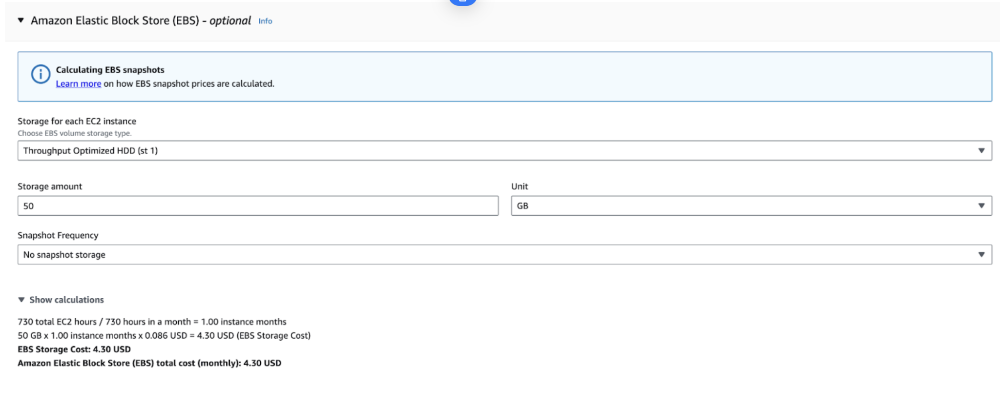
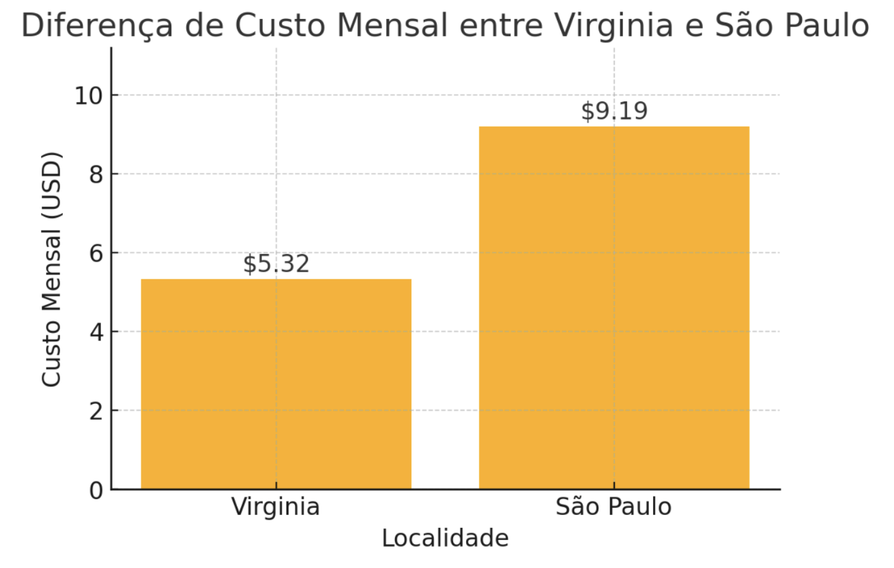

# Custo AWS

## 1. Escolha da Máquina

Atualmente, estamos utilizando a máquina **t4g.micro**, que apresenta o melhor custo-benefício considerando os requisitos do projeto.

- **Custo mensal na região de Virginia**: **5.32 USD**
- **Custo mensal na região de São Paulo**: **9.19 USD**

Além disso, considerando um uso de **50 GB no HD** e os requisitos mínimos necessários:

Dessa forma, determinamos que **a região de Virginia é mais barata do que São Paulo**.

## 2. Restrições Legais e Performance

Se houver **restrições legais para armazenamento fora do Brasil**, a única opção viável é hospedar a máquina na **região de São Paulo**, mesmo que o custo seja maior. Isso evita possíveis problemas relacionados à **LGPD**.

Além disso, por **São Paulo ser a mesma região onde estamos**, o **tempo de resposta será mais rápido**, garantindo um melhor desempenho da aplicação.

