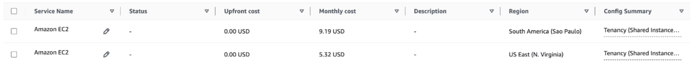
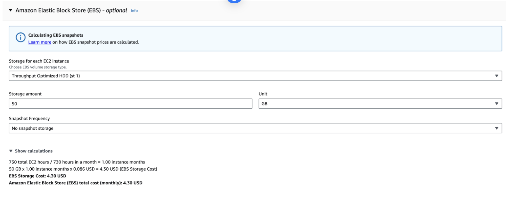
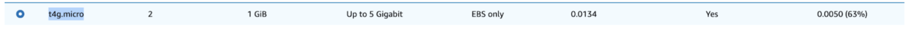
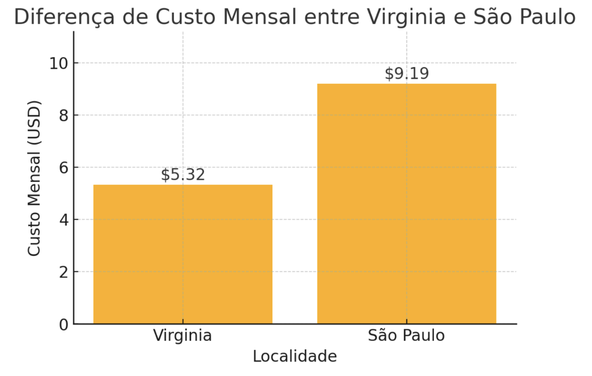
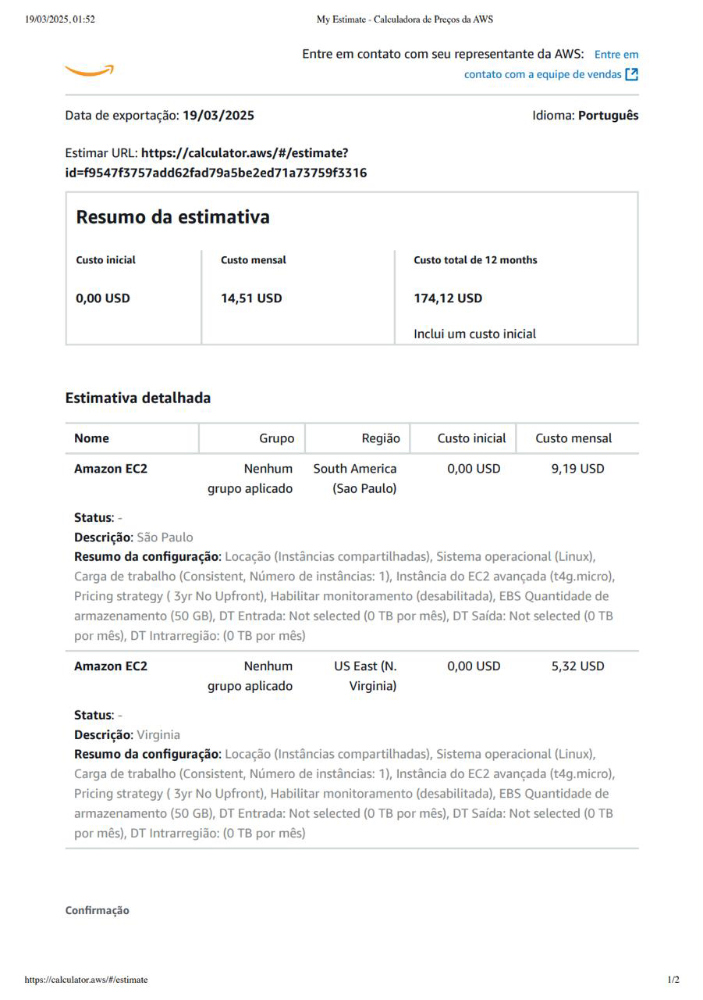

# FIAP - Faculdade de Informática e Administração Paulista

 

# FarmTech Solutions - Fase 5

## Beginner Coders

## 👨‍🎓 Integrantes: 
- <a href="https://www.linkedin.com/in/luana-porto-pereira-gomes/">Luana Porto Pereira Gomes</a>
- <a href="https://www.linkedin.com/in/luma-x">Luma Oliveira</a>
- <a href="https://www.linkedin.com/in/priscilla-oliveira-023007333/">Priscilla Oliveira </a>
- <a href="https://www.linkedin.com/in/paulobernardesqs?utm_source=share&utm_campaign=share_via&utm_content=profile&utm_medium=ios_app">Paulo Bernardes</a>  
- <a href="https://www.linkedin.com/in/pedrosof/">Fabio Pedroso</a>

## 👩‍🏫 Professores:
### Tutor(a) 
- <a href="https://www.linkedin.com/in/lucas-gomes-moreira-15a8452a/">Lucas Gomes Moreira</a>
### Coordenador(a)
- <a href="https://www.linkedin.com/in/profandregodoi/">André Godoi</a>

## 📜 Descrição

Este projeto tem como objetivo analisar dados agrícolas e prever o rendimento das safras com base em variáveis climáticas. Foram aplicadas técnicas de análise exploratória, clusterização e modelagem preditiva usando Machine Learning.

## 📁 Estrutura de pastas

Dentre os arquivos e pastas presentes na raiz do projeto, definem-se:

- <b>assets</b>: aqui estão os arquivos relacionados a elementos não-estruturados deste repositório, como imagens.

- <b>documents</b>: aqui estão todos os documentos do projeto que as atividades poderão pedir. Na subpasta "other", adicione documentos complementares e menos importantes.

- <b>README.md</b>: arquivo que serve como guia e explicação geral sobre o projeto (o mesmo que você está lendo agora).

## 🔧 Como executar o código
### Código Python:
   - Executar por meio do link do notebook: https://colab.research.google.com/drive/1OgVv8G6Kv0NWZYZCcAe3nVkq9iR2ADwh?usp=sharing

## Link do vídeo: https://youtu.be/14g8zH5sBxM?si=4cZBpfTk97txUQl7

# Custo AWS

## 1. Escolha da Máquina

Atualmente, estamos utilizando a máquina **t4g.micro**, que apresenta o melhor custo-benefício considerando os requisitos do projeto.

- **Custo mensal na região de Virginia**: **5.32 USD**
- **Custo mensal na região de São Paulo**: **9.19 USD**

Além disso, considerando um uso de **50 GB no HD** e os requisitos mínimos necessários:

Dessa forma, determinamos que **a região de Virginia é mais barata do que São Paulo**.

## 2. Restrições Legais e Performance

Se houver **restrições legais para armazenamento fora do Brasil**, a única opção viável é hospedar a máquina na **região de São Paulo**, mesmo que o custo seja maior. Isso evita possíveis problemas relacionados à **LGPD**.

Além disso, por **São Paulo ser a mesma região onde estamos**, o **tempo de resposta será mais rápido**, garantindo um melhor desempenho da aplicação.

## Link video:
https://youtu.be/jQ2uuJdhVgg?si=CnEC-fd8g4sWA3L1
 

## 🗃 Histórico de lançamentos

* 0.5.0 - XX/XX/2024
    * 
* 0.4.0 - XX/XX/2024
    * 
* 0.3.0 - XX/XX/2024
    * 
* 0.2.0 - XX/XX/2024
    * 
* 0.1.0 - XX/XX/2024
    *

## 📋 Licença

<a property="dct:title" rel="cc:attributionURL" href="https://github.com/agodoi/template">MODELO GIT FIAP</a> por <a rel="cc:attributionURL dct:creator" property="cc:attributionName" href="https://fiap.com.br">Fiap</a> está licenciado sobre <a href="http://creativecommons.org/licenses/by/4.0/?ref=chooser-v1" target="_blank" rel="license noopener noreferrer" style="display:inline-block;">Attribution 4.0 International</a>.

